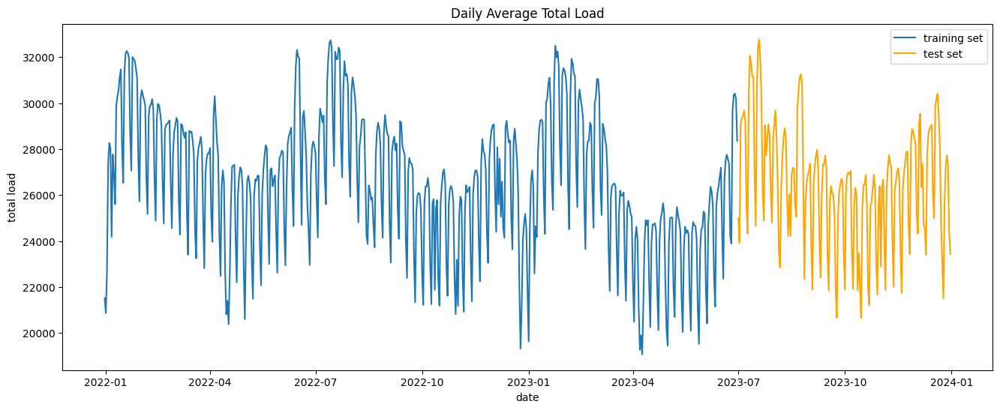
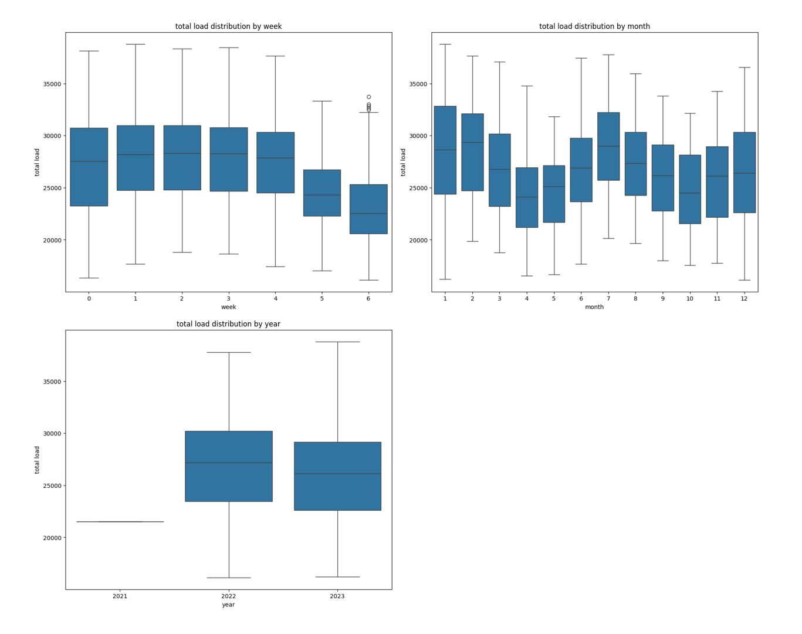
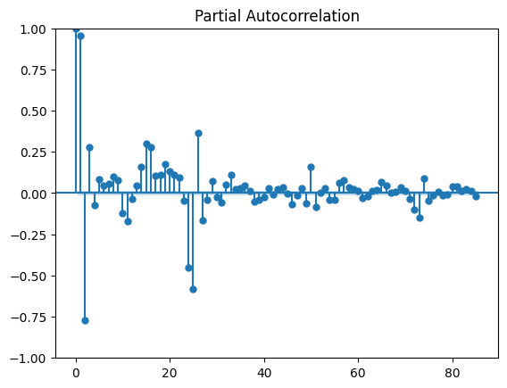

# Exploratory Data Analysis

## Datasets
### Consumption Data
ENTSO-E, the European Network of Transmission System Operators for Electricity, provides a free API which gives users access to historical and current data from different TSOs around Europe. The power consumption data used in this project is taken from the ENTSO-E API, and consists of the hourly total consumption data for Spain. 

### Weather Data
The weather dataset is taken from the OpenWeather API and contains hourly weather data including metrics such as temperature, wind speed and cloud coverage for the corresponding consumption data timestamps in Madrid, Spain.
## Time Series Analysis

### Seasonality

Seasonality in time-series data are patterns that occur at regular intervals. Seasonal patterns can be found by observing the average distribution of data during different time periods.

The following observations from these plots can be made about the dataset :
* The weekly reoccurring weekly patterns in the data show that on weekends, there is a large dip in electrical load.
* There is larger electrical demand during hotter months (the peak of summer) and colder months (the peak of winter). Power consumption dips during the surrounding months because of milder temperatures experienced during these months.
* The yearly average hourly distributions show that there is a decrease in total consumption across the 2 years of data. This may indicate that there is a long-term trend within the data.

The seasonal patterns found from this analysis provide new exogenous variables which can be used during model training.

### Lag Features
Serial dependence is a property where there is a relationship between target data and target data in the past. Serial dependence can be observed where there is cyclic behavior not necessarily because of a change in time but instead because of dependance with previous target values. 

Partial autocorrelation measures the linear relationship between the current target observation and a particular lag, removing the correlation over all the lags in between. A correlogram plot is used to visualize the autocorrelation or partial autocorrelation for a dataset, showing strength of the positive or negative correlation between the current observation and its lags.

Partial autocorrelation for the first 85 lags:

## XGBoost Algorithm Results

The performance of different model prototypes can be evaluated using their Mean Absolute Error (MAE) when tested on the test data.

| First Header  |      MAE      |
| ------------- | ------------- |
| XGBoost + Lags only  | 1440      |
| XGBoost + Lags + Tuning Paramters  | 1242    |
| XGBoost + Lags + Tuning Paramters + Exo Variables (excluding weather data)  | 885    |
| XGBoost + Lags + Tuning Paramters + Exo Variables (including weather data)   | 787    |

## Next Steps
To further the development of this project, the goals for continuing the development of this project include:
* Creating a flask API that will be used to serve the models to the web app.
* Deployment of an additional model that will make predictions for daily load data.
* Testing and deployment of an LTSM model for the data using Pytorch and AWS.
  
